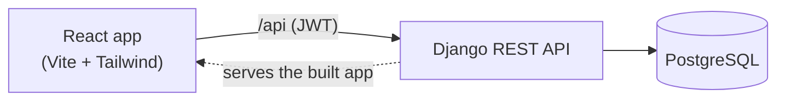
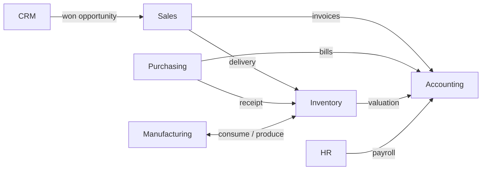

<div align="center">

# NexusERP

**Learn how a complete SME ERP works, by using one.**

A full-featured, Odoo-style ERP for a small furniture company — CRM, Sales, Purchasing, Inventory, Manufacturing,
Accounting, HR & Payroll — with a built-in **ERP Academy** (11 chapters + quizzes) and **10 guided scenarios**
that run real business stories step by step and explain every effect on stock and accounting.

`Django 5` · `React 19` · `PostgreSQL 17` · `Tailwind 4` · Apple-style dark UI

</div>

---

## Contents

- [Quick start (Windows, one file)](#quick-start-windows-one-file)
- [Quick start (macOS / Linux / any OS with Docker)](#quick-start-macos--linux--any-os-with-docker)
- [What you can learn](#what-you-can-learn)
- [Modules](#modules)
- [Guided scenarios](#guided-scenarios)
- [How the accounting works](#how-the-accounting-works)
- [Architecture](#architecture)
- [For developers](#for-developers)
- [Troubleshooting](#troubleshooting)
- [Limits (what this is not)](#limits-what-this-is-not)

---

## Quick start (Windows, one file)

1. **Get the code** — either
   - click **Code → Download ZIP** on GitHub (or download the latest **Release**) and unzip it, **or**
   - `git clone https://github.com/Kaissabbegh/NEXUSERP.git`
2. **Double-click `NexusERP.bat`** in the folder.
3. Wait for *“NexusERP is ready”* (5–10 minutes the first time, a few seconds afterwards). Your browser opens
   **http://localhost:8000** and the window shows your **username and password**.

That's it. Keep the black window open while you use the app; close it (or press `Ctrl+C`) to stop.
Next time, double-click `NexusERP.bat` again — it starts in seconds.

<details>
<summary><b>What does NexusERP.bat do?</b></summary>

It runs [`scripts/nexus.ps1`](scripts/nexus.ps1), which skips every step that is already done:

| Step | Details |
|---|---|
| Checks / installs **Python 3.11+**, **Node.js 20+**, **PostgreSQL** | Uses `winget` (built into Windows 10/11) only for what is missing. Windows may ask for permission. |
| Creates a **private database** | A separate PostgreSQL cluster in `%LOCALAPPDATA%\NexusERP` on port **5544**, so it never touches another PostgreSQL you may have. Its password is generated and stored there. |
| Installs the app | Python packages in `backend/.venv`, JavaScript packages, builds the web interface. |
| Loads the demo company | *Nexus Furniture*: products, customers, vendors, employees, 6 months of history. |
| Starts the server | One process on http://localhost:8000 serving both the API and the web app. |

Options: `NexusERP.bat -NoStart` (install/update only), `NexusERP.bat -Port 8080`.
</details>

**Updating:** `git pull` (or download the new ZIP into the same folder), then run `NexusERP.bat`.
Migrations and new demo data are applied automatically; your existing data is kept.

---

## Quick start (macOS / Linux / any OS with Docker)

Requires [Docker Desktop](https://www.docker.com/products/docker-desktop/).

```bash
git clone https://github.com/Kaissabbegh/NEXUSERP.git
cd NEXUSERP
docker compose up --build
```

Open **http://localhost:8000**. The login is printed in the logs (look for *“NexusERP is ready”*).
Stop with `Ctrl+C`; `docker compose down -v` deletes everything.

---

## What you can learn

### ERP Academy — a complete course inside the app

| # | Chapter | You learn |
|---|---|---|
| 1 | **What is an ERP?** | Single database, modules, integration, master vs. transactional data, ERP vendors |
| 2 | **Master Data** | Contacts, products, categories, taxes, chart of accounts, data quality |
| 3 | **CRM & Sales** | Leads → opportunities → quotations → orders → delivery → invoice → payment; returns, credit notes, credit limits |
| 4 | **Purchasing** | RFQ → PO → receipt → bill → payment, three-way match, replenishment |
| 5 | **Inventory & Warehouse** | Locations, stock moves, on hand / reserved / forecast, valuation methods, counts |
| 6 | **Manufacturing** | Bills of materials, manufacturing orders, MRP, product cost |
| 7 | **Accounting & Finance** | Double entry, receivable vs. payable, VAT, fixed assets & depreciation, month-end close |
| 8 | **HR & Payroll** | Employees, gross → net, employer charges, expense claims |
| 9 | **Reporting & KPIs** | P&L, balance sheet, cash vs. profit, DSO/DPO, turnover |
| 10 | **Beyond the Core** | POS, e-commerce, projects, helpdesk, maintenance, multi-company… |
| 11 | **ERP Implementation** | Discovery, fit-gap, data migration, UAT, training, go-live, hypercare, pitfalls |

Every chapter contains: goals, a plain-English explanation, *who does what*, process flows, key concepts,
an **accounting impact table**, integration with other modules, KPIs, best practices & mistakes,
a **consultant toolkit** (questions to ask the client, data to migrate, what to configure), links to try it
live, the matching scenarios, and a **quiz** with explanations. Progress is saved in your browser.

Also included: an animated **ERP Map**, a searchable **Glossary** (75+ terms), and lesson cards on every screen.

---

## Modules

| Area | Screens |
|---|---|
| **Overview** | Dashboard (selling & buying pipelines, KPIs), ERP Academy, Guided Scenarios, ERP Map, Glossary |
| **Master data** | Contacts (customers/vendors, payment terms, credit limit), Products (types, taxes, vendor, margin), Chart of Accounts |
| **Sales & CRM** | CRM pipeline (Kanban, weighted pipeline, win rate), quotations & sales orders with an **Order-to-Cash flow diagram**, returns, credit notes, refunds |
| **Purchasing** | RFQs & purchase orders with a **Procure-to-Pay flow diagram**, three-way match, replenishment suggestions |
| **Inventory** | Stock levels (on hand / reserved / available / incoming), physical counts, transfers, average cost (AVCO) |
| **Manufacturing** | Bills of materials with cost & margin, manufacturing orders |
| **HR & Payroll** | Employees by department (gross / net / total cost), monthly payroll runs, expense claims |
| **Accounting** | Customer invoices & credit notes, vendor bills, payments in/out, fixed assets with depreciation schedules, manual journal entries |
| **Reports** | Profit & Loss, Balance Sheet, Who Owes Whom (aged receivables/payables) |

---

## Guided scenarios

Click a scenario and the app **creates the real documents and plays the story** one business event at a time.
Each step shows who does it, an explanation with the actual numbers, the documents created (clickable),
stock before → after, the journal entries, and how the money buckets (bank, receivables, payables, VAT, profit…) moved.

| # | Scenario | Department |
|---|---|---|
| 1 | Win a new client — lead → qualified → quotation → won | CRM |
| 2 | Sell office chairs — the full Order-to-Cash cycle | Sales |
| 3 | Customer returns a chair — return, credit note, refund | After-sales |
| 4 | The late payer — partial payment, credit limit blocks the next order | Credit control |
| 5 | Restock from a vendor — RFQ, receipt, bill, payment, average cost | Purchasing |
| 6 | Make desks to order — sale + manufacturing order | Manufacturing |
| 7 | Run the monthly payroll — gross → net → employer charges → payments | HR & Payroll |
| 8 | Employee expense claim — submit, approve, reimburse | HR & Accounting |
| 9 | Buy a delivery van — fixed asset and depreciation | Accounting |
| 10 | Month-end close — stock count, rent, payroll, VAT return, P&L | Accounting |

They are also good **UAT test scripts** for real ERP projects.

---

## How the accounting works

Every operation generates a balanced journal entry automatically:

| Event | Journal | Debit | Credit |
|---|---|---|---|
| Opening stock | STJ | 110100 Inventory | 301000 Capital |
| Delivery validated | STJ | 500000 Cost of Goods Sold | 110100 Inventory |
| Customer invoice | INV | 121000 Receivable | 400000 Sales + 251000 VAT Payable |
| Customer payment | BNK | 101000 Bank | 121000 Receivable |
| Return received | STJ | 110100 Inventory | 500000 Cost of Goods Sold |
| Credit note | INV | 400000 Sales + 251000 VAT Payable | 121000 Receivable |
| Refund | BNK | 121000 Receivable | 101000 Bank |
| Receipt validated | STJ | 110100 Inventory | 110200 Stock Interim |
| Vendor bill | BILL | 110200 Stock Interim + 131000 VAT Receivable | 211000 Payable |
| Vendor payment | BNK | 211000 Payable | 101000 Bank |
| Production | STJ | 110100 Inventory (finished) | 110100 Inventory (components) |
| Stock count shortage | STJ | 630000 Inventory Differences | 110100 Inventory |
| Payroll posted | SAL | 620000 Salaries + 621000 Employer charges | 256000 Net salaries + 254000 Social security + 255000 Tax withheld |
| Expense claim approved | MISC | 6xxxxx Expense | 257000 Employee payable |
| Fixed asset bought | BILL | 153000 Vehicles / 151000 Equipment + VAT | 211000 Payable |
| Depreciation | MISC | 681000 Depreciation expense | 152000 Accumulated depreciation |

Accounts come from master data: product categories, taxes, contacts and journals.

---

## Architecture





```
NEXUSERP/
├── NexusERP.bat              ← double-click to install & run (Windows)
├── docker-compose.yml        ← docker compose up (any OS)
├── scripts/                  launcher (nexus.ps1), create_db.py, dev helpers
├── backend/                  Django project
│   ├── config/               settings, urls (also serves frontend/dist)
│   ├── masterdata/           partners, products, taxes, sequences, seed_demo command
│   ├── crm/                  leads & opportunities
│   ├── sales/                quotations, orders, returns, credit notes
│   ├── purchase/             RFQs, purchase orders, bills, replenishment
│   ├── inventory/            locations, transfers, stock moves, valuation, counts
│   ├── mrp/                  bills of materials, manufacturing orders
│   ├── accounting/           accounts, journals, entries, payments, reports
│   ├── hr/                   employees, payroll, expense claims
│   ├── fixedassets/          assets and depreciation
│   └── scenarios/            guided scenario engine + the 10 stories
└── frontend/                 React 19 + TypeScript + Tailwind 4
    └── src/
        ├── pages/            one file per screen (Academy, Scenarios, CRM, Sales…)
        ├── components/       UI kit, flow diagram, journal entry, layout
        └── lib/academy/      the course content (11 chapters)
```

Business rules live in each app's `services.py` (e.g. `sales/services.py → confirm, create_invoice, create_credit_note`).

---

## For developers

```powershell
# Backend (port 8000)
cd backend
.\.venv\Scripts\python manage.py runserver

# Frontend with hot reload (port 5173, proxies /api to 8000)
cd frontend
npm run dev

# Backend tests (a fresh demo company is seeded in a throwaway database)
cd backend
.\.venv\Scripts\python manage.py test
```

- Admin: http://localhost:8000/admin (same demo login).
- Re-running `python manage.py seed_demo` only adds what is missing, so it is safe after pulling new versions.
- CI ([`.github/workflows/ci.yml`](.github/workflows/ci.yml)) runs the backend tests, the frontend build and a Docker smoke test on every push.

---

## Troubleshooting

| Problem | Fix |
|---|---|
| **“An Application Control policy has blocked this file”** | Windows *Smart App Control* blocks some developer tools. Turn it off in *Windows Security → App & browser control → Smart App Control*, or use the Docker option. |
| `winget` not found | Install *App Installer* from the Microsoft Store, or install Python, Node.js and PostgreSQL manually, then rerun `NexusERP.bat`. |
| “Python/Node was installed but is not on PATH yet” | Close the window and run `NexusERP.bat` again. |
| Port 8000 already in use | Run `NexusERP.bat -Port 8080` and open http://localhost:8080. |
| Forgot the password | It is in `backend\.env` (`DEMO_PASSWORD=`). |
| Page shows *“502”* or *“Frontend not built yet”* | Rerun `NexusERP.bat`; it restarts the database and rebuilds what is missing. |
| Start from scratch | Stop the app, delete `%LOCALAPPDATA%\NexusERP` and `backend\.env`, then run `NexusERP.bat`. |

---

## Limits (what this is not)

NexusERP is a **learning tool and prototype**, not production software: one company, one currency, one warehouse,
simplified payroll rates (9% / 10% / 21%), no user roles, debug mode on, and it runs on your own machine.
Real ERPs (Odoo, ERPNext, Business Central, SAP Business One, NetSuite…) add price lists, multi-company,
lots/serials, bank feeds, country-specific taxes and payroll, permissions, and much more — the Academy
explains these so you know what to look for.
